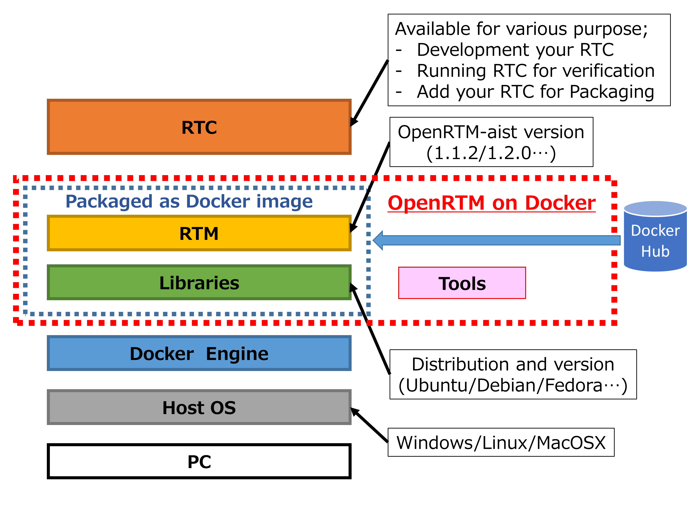
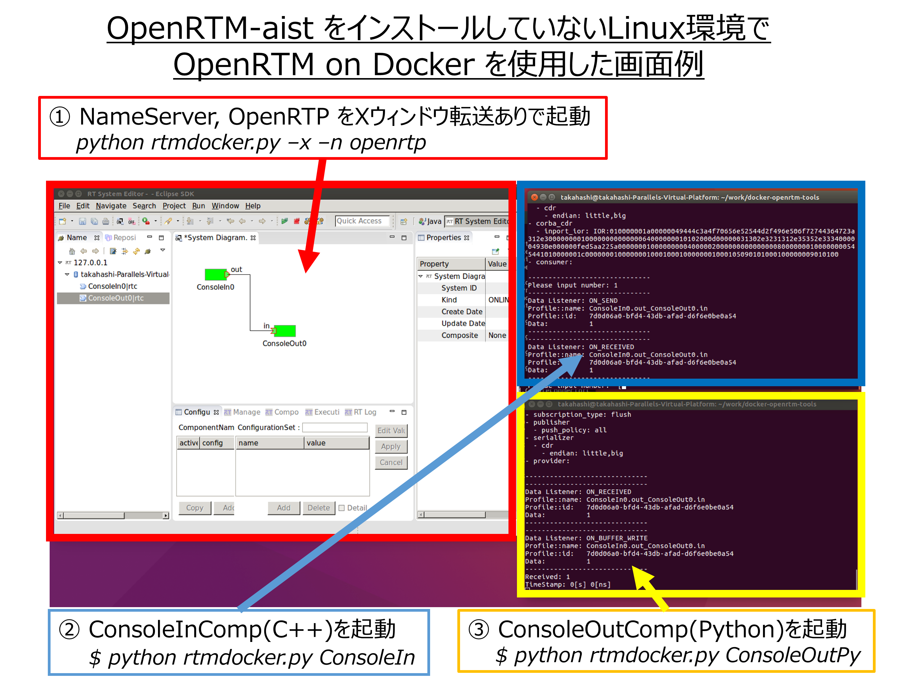
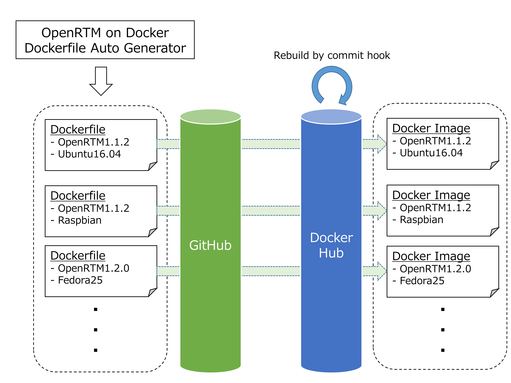

.. test documentation master file, created by
   sphinx-quickstart on Mon Nov 28 17:18:29 2016.
   You can adapt this file completely to your liking, but it should at least
   contain the root `toctree` directive.

OpenRTM on Docker
=================

.. list-table::

  * - Version
    - |release|
  * - Last Update
    - |today|
  * - Author
    - Saburo Takahashi

更新履歴
========

.. csv-table::
  :header-rows: 1
  :widths: 1, 3, 2, 8, 4
  :file: ../data/history.csv


目次
====

.. toctree::
   :maxdepth: 2
   :numbered:
   :glob:

   index

0. OpenRTM on Dockerって何？
============================
OpenRTM on Dockerは `OpenRTM-aist <http://www.openrtm.org/openrtm/>`_ がインストールされたDockerイメージおよび周辺ツール群の総称です．

開発の動機
----------
OpenRTM-aistをもっと簡単に使いたい！
````````````````````````````````````
RTコンポーネント(RTC)を開発する場合、汎用性や後方互換製に配慮する必要があります．
そのためには、OSのバージョンやRTミドルウェアのバージョン、開発PCにインストールされているさまざまなライブラリとの依存関係を疎にする必要があります．
この作業、特に開発環境を整備することが非常に大変で、開発コストの増加に繋がります．
そこで、RTミドルウェアを含むさまざまなライブラリの組み合わせをDockerイメージとして提供することで、開発環境構築コストを低減できると考えました．
また，RTミドルウェア講習会などを通じて，OpenRTM-aistインストールにおけるトラブル事例が多く発生しており，その原因が各自のホスト環境の違いに起因していると感じていました．
OpenRTM on Docker はホストOSの環境差異を吸収でき，実行環境に依らず不変（immutable）な動作ができます．


1. 概要
=======

1.1. 目的
---------

本書はOpenRTM on Dockerの機能や利用方法について記載したドキュメントです．
Docker のインストール方法，OpenRTM on Dockerのイメージ一覧，関連ツールの利用方法を記しています．


1.2. 位置づけ
-------------

本書はOpenRTM on Dockerを利用しているユーザ，および利用を検討している方に向けたドキュメントです．

1.3. 対象ユーザ
------------------

* RTC設計，開発，検証担当者
* RTシステム検証担当者
* RTCおよびRTシステムリリース，運用担当者
* RTM設計，開発，検証担当者
* RTMリリース，運用担当者
* RTM講習会，チュートリアル受講生

1.4. 記載範囲
------------------

* 概要
* 機能
* 制約条件
* 使用方法
* FAQ

1.5. 参照ドキュメント/URL
-------------------------

.. csv-table:: 参照ドキュメント/URL一覧
  :header-rows: 1
  :widths: 1, 4, 6
  :file: ../data/references.csv


1.6. 定義（用語、略語）
-----------------------

.. csv-table:: 用語定義一覧
  :header-rows: 1
  :widths: 1, 2, 6
  :file: ../data/grossary.csv


2. システム構成
==================
OpenRTM on Dockerに含まれるDockerイメージははDocker Engine上で動作するOSとOpenRTM-aistをまとめたコンテナです．
これらのイメージはDocker公式レポジトリであるDocker Hubに各バージョンの最新版が登録されており，複雑な処理無しに利用可能です．
また，OpenRTM on Dockerにはコンテナ起動のためのスクリプト群 OpenRTM on Docker Tools が準備されており，
より簡単に OpenRTM-aist がインストールされた Docker コンテナを試すことができます．




3. 機能概要
==================

OpenRTM on Dockerを利用して実現できること
------------------------------------------
- OpenRTM-aist をホストOSにインストールせずに利用することができる
 - OpenRTPやサンプルコンポーネントをホストPCにインストールせずに起動できる
- 様々なバージョンのOpenRTM-aistを利用したコンパイルや動作確認ができる
 - OS（Ubuntu/Debian/Fedora），OpenRTM-aist（1.1.2/1.2.0（開発途中版）），言語（C++，Python，Java）などの組み合わせが準備済み 
- OpenRTM on Docker を簡単に試すことができるスクリプト群（OpenRTM on Docker Tools）を整備

.. list-table:: OpenRTM on Dockerの応用イメージ

  * - .. image:: ../img/sample1.png
        :width: 100%
    - .. image:: ../img/sample2.png
        :width: 100%


OpenRTM on Dockerを利用した際の画面例
------------------------------------------
OpenRTM on Docker を用いて，OpenRTM-aist がインストールされていない Linux 環境で NameServer，OprenRTP，サンプルコンポーネント（ConsoleIn，ConsoleOut）を接続した画面例を下記に示します．




OpenRTM on Dockerイメージの管理方法
------------------------------------------
OpenRTM-aistやOSのバージョン，プログラミング言語などの組み合わせ数が多いため，
Dockerイメージを作成するためのDockerfileをスクリプトで自動生成し，GitHubに登録しました．
さらにDocker HubとGitHubを連携することで，GitHubの変更を検出し自動的にDockerイメージがビルドされるようになっています．
この仕組みを構築することで，OSのやOpenRTM-aistが更新された場合でも，容易にOpenRTM on Dockerイメージを更新することができます．




4. 制約条件
==================

.. _environment:

動作環境
-----------------------------
現在 OpenRTM on Docker の動作が確認できているのは下記のホストOSです．
Dockerの仕様上，64bit OSしかサポートしていません．
下記はDockerが正式サポートしているものを列挙していますが，
下記以外においても Docker がインストールできれば OpenRTM on Dockerイメージは動作可能です．

.. list-table:: 動作確認できているホストOS
  :header-rows: 0
  :stub-columns: 1

  * - Windows
    - | Windows Server 2016 64bit（確認中）
      | Windows 10 64bit
  * - Linux
    - | Ubuntu Trusty 14.04 64bit
      | Ubuntu Xenial 16.04 64bit
      | Ubuntu Zesty 17.04 64bit
      | Ubuntu Artful 17.10 64bit（確認中）
      | Fedora 24（確認中）
      | Fedora 25（確認中）
      | CentOS 7（確認中）
      | Debian Wheezy 7.7
      | Debian Jessie 8
      | Debian Stretch 9（確認中）
      | Debian Buster 10（確認中）
      | Raspbian Wheezy 7.7
      | Raspbian Jessie 8
      | Raspbian Stretch 9（確認中）
  * - Mac
    - | OS X El Capitan 10.11
      | macOS Sierra 10.12（確認中）
      | macOS High Sierra 10.13（確認中）


.. _license:

ライセンス
-----------------------------
OpenRTM on Docker に含まれる Dockerfile やツール群はMITライセンスにより配布されます．
しかし，OpenRTM on Docker イメージに含まれるOSおよび周辺ソフトウェア，OpenRTM-aistのライセンスは別です．
また，ホストOSにインストールされた Docker エンジンについてもライセンスは別扱いとなります．
利用時は最新の情報やインストールしたバージョンを確認し，ライセンス条約に遵守するようにして下さい．

下記に関連する代表的なソフトウェアのライセンス記載箇所を示しますが，
これらは本書執筆時点の情報であるため，
再配布等を行う場合は利用者が再度確認してご利用下さい．

.. list-table:: 代表的なソフトウェアのライセンス

  * - Docker Community Edition
    - Apache License 2.0
    - https://github.com/moby/moby/blob/master/LICENSE
  * - Docker Components
    - 右記参照
    - https://www.docker.com/components-licenses
  * - OpenRTM-aist
    - | OpenRTM-aist (C++、Java、Python版)は LGPL と個別契約のデュアルライセンス
      | RTSystemEditor、RTCBuilder は EPL と個別契約のデュアルライセンス
    - http://openrtm.org/openrtm/ja/content/openrtm-aist%E3%81%A8%E3%81%AF%EF%BC%9F-0
  * - OpenRTM on Docker
    - MIT License
    - https://github.com/takahasi/docker-openrtm/blob/master/LICENSE

5. 使用方法
==================

事前準備（Dockerのインストール）
--------------------------------
インストールする必要があるのは Docker とその依存パッケージのみです．
OpenRTM-aist に関係するパッケージのインストールは一切必要ありません．

Dockerの最新インストール方法はDockerホームページに記載されています．
https://docs.docker.com/engine/installation/

現在，DockerにはCommunity EditionとEnterprise Editionの2種があります．
本書では無料で利用可能な Community Edition を使用する想定で記載していますが，
Enterprise Editionを利用する場合でも一部インストール中の画面構成等が異なるだけで，
本書記載のOpenRTM on Dockerの機能は利用できます．

Windows 
``````````````
Windows ホスト向けDocker(Docker for Windows)は Hyper-V もしくは Virtualbox を利用してLinuxバーチャルマシンを起動し，そのゲストOS上でDockerエンジンを起動します．

1. https://download.docker.com/win/stable/Docker%20for%20Windows%20Installer.exe から Docker のインストーラ(Docker for Windows Installer.exe)をダウンロードします
2. ダウンロードした Docker for Windows Installer.exe を実行し，セットアップウィザードが開始されるので，ライセンスを確認し"I agree"を選択します
3. インストールが開始され，完了後にセットアップウィザードの"Finish"を選択します
4. アプリケーションから Docker for Windows を起動すると Docker が常駐ソフトとして起動されます
5. https://docs.docker.com/docker-for-windows/install/#install-docker-for-windows に詳細が記載されています

Linux(Ubuntu)
``````````````
1. 下記のコマンドを順番にシェル上で実行します

.. code-block:: sh

  $ sudo apt-get remove docker docker-engine docker.io
  $ sudo apt-get update
  $ sudo apt-get install apt-transport-https ca-certificates curl software-properties-common
  $ curl -fsSL https://download.docker.com/linux/ubuntu/gpg | sudo apt-key add -
  $ sudo apt-key fingerprint 0EBFCD88
  $ sudo add-apt-repository "deb [arch=amd64] https://download.docker.com/linux/ubuntu $(lsb_release -cs) stable"
  $ sudo apt-get update
  $ sudo apt-get install docker-ce

2. sudo docker run hello-world を実行し，エラーが発生しなければインストール成功
3. https://docs.docker.com/engine/installation/linux/docker-ce/ubuntu/ に詳細が記載されています

また，下記ツールを利用すれば上記の手順を一括で処理することができます．

.. code-block:: sh

  $ curl -fsSL get.docker.com -o get-docker.sh
  $ chmod +x get-docker.sh
  $ sh get-docker.sh

Linux(Debian)
``````````````
1. 下記のコマンドを順番にシェル上で実行します

.. code-block:: sh

  $ sudo apt-get remove docker docker-engine docker.io
  $ sudo apt-get update
  $ sudo apt-get install apt-transport-https ca-certificates curl software-properties-common
  $ curl -fsSL https://download.docker.com/linux/$(. /etc/os-release; echo "$ID")/gpg | sudo apt-key add -
  $ sudo apt-key fingerprint 0EBFCD88
  $ sudo add-apt-repository "deb [arch=amd64] https://download.docker.com/linux/$(. /etc/os-release; echo "$ID") $(lsb_release -cs) stable"
  $ sudo apt-get update
  $ sudo apt-get install docker-ce

2. sudo docker run hello-world を実行し，エラーが発生しなければインストール成功
3. https://docs.docker.com/engine/installation/linux/docker-ce/debian/ に詳細が記載されています

また，下記ツールを利用すれば上記の手順を一括で処理することができます．

.. code-block:: sh

  $ curl -fsSL get.docker.com -o get-docker.sh
  $ chmod +x get-docker.sh
  $ sh get-docker.sh

Linux(Fedora)
``````````````
1. 下記のコマンドを順番にシェル上で実行します

.. code-block:: sh

  $ sudo dnf remove docker docker-common docker-selinux docker-engine-selinux docker-engine
  $ sudo dnf -y install dnf-plugins-core
  $ sudo dnf config-manager --add-repo https://download.docker.com/linux/fedora/docker-ce.repo
  $ sudo dnf install docker-ce
  $ sudo systemctl start docker

2. sudo docker run hello-world を実行し，エラーが発生しなければインストール成功
3. https://docs.docker.com/engine/installation/linux/docker-ce/fedora/  に詳細が記載されています

また，下記ツールを利用すれば上記の手順を一括で処理することができます．

.. code-block:: sh

  $ curl -fsSL get.docker.com -o get-docker.sh
  $ chmod +x get-docker.sh
  $ sh get-docker.sh

Linux(CentOS)
``````````````
.. code-block:: sh

  $ sudo yum remove docker docker-common docker-selinux docker-engine
  $ sudo yum install -y yum-utils device-mapper-persistent-data lvm2
  $ sudo yum-config-manager --add-repo https://download.docker.com/linux/centos/docker-ce.repo
  $ sudo yum install docker-ce
  $ sudo systemctl start docker

2. sudo docker run hello-world を実行し，エラーが発生しなければインストール成功
3. https://docs.docker.com/engine/installation/linux/docker-ce/centos/  に詳細が記載されています

Linux(Raspbian)
````````````````
下記ツールを利用すれば一括で処理することができます．

.. code-block:: sh

  $ curl -fsSL get.docker.com -o get-docker.sh
  $ chmod +x get-docker.sh
  $ sh get-docker.sh

MacOSX
``````````````
1. https://download.docker.com/mac/stable/Docker.dmg から Docker のディスクイメージ(Docker.dmg)をダウンロードします
2. ダウンロードした Docker.dmg を実行し，Docker アイコンを Applications フォルダにドラッグ＆ドロップします
3. インストールが開始され，成功後は Docker が常駐ソフトとして起動されます
4. https://docs.docker.com/docker-for-mac/install/ に詳細が記載されています


OpenRTM on Docker 利用方法
--------------------------
Docker が既にインストールされている環境であれば OpenRTM on Docker が利用できます．  
イメージをダウンロードしてキャッシュするため，初回起動時は外部ネットワークに接続されている必要があり，  
初回起動時のみ起動まで時間がかかります（ネットワーク環境に依存しますが，数分程度）．  
一度キャッシュされてしまえば，２回目移行の起動は速くなります（コンピュータスペックに依存しますが１秒未満）．

OpenRTM on Docker Tools を利用する方法（推奨）
``````````````````````````````````````````````

Linux，MacOSXの場合
''''''''''''''''''''''''''''''''''''''''''''''''''''
- rtmdocker.sh の詳細なオプションについては次節を参照下さい
- タグを指定しない場合，最新の全パッケージ入り OpenRTM on Docker イメージを利用します
- HOMEディレクトリが共有されてDockerイメージ内のシェルが起動します  
- シェルを抜けるとコンテナが消去されます
- ネットワークはホストのネットワークデバイスを利用する設定となっているため，コンテナ内でRTCを起動した場合もホストOS上でRTCを起動した場合と等価に見えます

.. code-block:: sh

  $ wget https://raw.githubusercontent.com/takahasi/docker-openrtm-tools/master/rtmdocker.sh
  $ chmod +x rtmdocker.sh
  $ ./rtmdocker.sh

例えば，サンプルコンポーネントである ConsoleOutComp を動作させる場合，下記のように入力します．

.. code-block:: sh

  $ ./rtmdocker.sh ConsoleOut

Windowsの場合
''''''''''''''''''''''''''''''''''''''''''''''''''''
- https://raw.githubusercontent.com/takahasi/docker-openrtm-tools/master/rtmdocker.bat をダウンロード
- rtmdocker.bat の詳細なオプションについては次節を参照下さい
- タグを指定しない場合，最新の全パッケージ入り OpenRTM on Docker イメージを利用します
- HOMEディレクトリが共有されてDockerイメージ内のシェルが起動します  
- シェルを抜けるとコンテナが消去されます
- ネットワークはホストのネットワークデバイスを利用する設定となっているため，コンテナ内でRTCを起動した場合もホストOS上でRTCを起動した場合と等価に見えます

.. code-block:: sh

  $ rtmdocker.bat

GUIアプリケーションを使う方法
````````````````````````````````````````````````````````

リモートデスクトッププロトコル(RDP)で接続する場合
''''''''''''''''''''''''''''''''''''''''''''''''''''

RDP（Remote Desktop Protocol）サーバがインストールされたイメージを利用している場合，
リモートデスクトップクライアントをホストにインストールし，
リモートデスクトップクライアントからローカルホストに対して接続することで，
OpenRTM on Dockerコンテナ内のデスクトップ画面を表示することができます．

* ユーザ名:root
* パスワード:root


Xウィンドウを利用して接続する場合  (Linux/Mac ホストの場合) :  
''''''''''''''''''''''''''''''''''''''''''''''''''''''''''''''

.. code-block:: sh

  $ wget https://raw.githubusercontent.com/takahasi/docker-openrtm-tools/master/rtmdocker.sh
  $ chmod +x rtmdocker.sh
  $ ./rtmdocker.sh -x

例えば，OpenRTPを利用したい場合，下記のようなコマンドを入力することで起動できます．

.. code-block:: sh

  $ ./rtmdocker.sh -x openrtp


Docker コマンドを直接利用する方法（中級者向け）
````````````````````````````````````````````````````````
Docker コマンドで直接イメージを起動する方法 
''''''''''''''''''''''''''''''''''''''''''''''''''''''''''''''

.. code-block:: sh

  $ docker run --rm -ti takahasi/docker-openrtm bash

Docker イメージのバージョンを指定し起動する方法
'''''''''''''''''''''''''''''''''''''''''''''''''''''''''

.. code-block:: sh

  $ docker run --rm -ti takahasi/docker-openrtm:ubuntu1404_openrtm112 bash

Dockerfileを使ってOpenRTM on Dockerイメージをカスタマイズする方法
''''''''''''''''''''''''''''''''''''''''''''''''''''''''''''''''''''''''''''

下記を Dockerfile に記載することで，ベースとなるOpenRTM on  Docker イメージを利用できます．: 

.. code-block:: sh

  FROM takahasi/docker-openrtm:ubuntu1404_openrtm112


例えば，自作したコンポーネントを起動時に動作させるためには，
下記のような Dockerfile を作成することでカスタムイメージを作成できます．: 

.. code-block:: sh

  FROM takahasi/docker-openrtm:ubuntu1404_openrtm112
  
  COPY MyComponent /usr/local/bin/
  CMD ["MyComponent", ""]


OpenRTM on Docker Tools
----------------------------------
OpenRTM on Docker Tools とは，OpenRTM on Docker を実行するためのツール群です．

現在下記のツールが利用可能です．
詳細オプションについては後述します．

.. list-table:: OpenRTM on Docker Toolsに含まれるツール
  :stub-columns: 1

  * - rtmdocker.sh
    - Linux/MacOSX向けOpenRTM on Dockerイメージ起動スクリプト
  * - rtmdocker.bat
    - Windows向けOpenRTM on Dockerイメージ起動スクリプト

rtmdocker.sh
`````````````
rtmdocker.sh はLinux/MacOSX向けのOpenRTM on Dockerイメージを起動するためのスクリプトです．
起動時にオプションを指定することでコンテナ内のコンポーネントを起動，操作できます．
ネットワークはホストのネットワークデバイスを利用する設定となっているため，
コンテナ内でRTCを起動した場合もホストOS上でRTCを起動した場合と等価に見えます．

ダウンロード方法
''''''''''''''''

.. code-block:: sh

  $ wget https://raw.githubusercontent.com/takahasi/docker-openrtm-tools/master/rtmdocker.sh
  $ chmod +x rtmdocker.sh


使用方法
'''''''''
.. code-block:: sh

  $ ./rtmdocker.sh [オプション] コマンド

コマンド
''''''''
.. list-table:: rtmdocker.sh コマンド一覧
  :stub-columns: 1

  * - openrtp
    - OpenRTP を起動する
  * - bash
    - bash を起動する
  * - Composite
    - C++ サンプルコンポーネント "Composite" を起動する
  * - ConsigSample
    - C++ サンプルコンポーネント "ConsigSampleComp" を起動する
  * - ConsoleIn
    - C++ サンプルコンポーネント "ConsoleInComp" を起動する
  * - ConsoleInPy
    - Python サンプルコンポーネント "ConsoleInComp" を起動する
  * - ConsoleOut
    - C++ サンプルコンポーネント "ConsoleOutComp" を起動する
  * - ConsoleOutPy
    - Python サンプルコンポーネント "ConsoleOutComp" を起動する
  * - Controller
    - C++ サンプルコンポーネント "ControllerComp" を起動する
  * - Motor
    - C++ サンプルコンポーネント "MotorComp" を起動する
  * - SeqIn
    - C++ サンプルコンポーネント "SeqInComp" を起動する
  * - SeqInPy
    - Python サンプルコンポーネント "SeqInComp" を起動する
  * - SeqOut
    - C++ サンプルコンポーネント "SeqOutComp" を起動する
  * - SeqOutPy
    - Python サンプルコンポーネント "SeqOutComp" を起動する
  * - TkJoyStick
    - Python サンプルコンポーネント "TkJoyStick" を起動する
  * - TkLRFViewer
    - Python サンプルコンポーネント "TkLRFViewer" を起動する
  * - MyServiceConsumer
    - C++ サンプルコンポーネント "MyServiceConsumer" を起動する
  * - MyServiceConsumerPy
    - Python サンプルコンポーネント "MyServiceConsumer" を起動する
  * - MyServiceProvider
    - C++ サンプルコンポーネント "MyServiceProvider" を起動する
  * - MyServiceProviderPy
    - Python サンプルコンポーネント "MyServiceProvider" を起動する
  * - Sensor
    - C++ サンプルコンポーネント "SensorComp" を起動する

オプション
''''''''''
.. list-table::  rtmdocker.sh オプション一覧
  :stub-columns: 1

  * - -h, --help
    - ヘルプメッセージを表示する
  * - -v, --version
    - ツールのバージョンを表示する
  * - -n, --nameserver
    - コマンド実行前にネームサーバーを起動する
  * - -t, --tag TAGNAME
    - 使用するDockerイメージのタグを指定する
  * - -r, --run COMPONENT
    - 指定したコンポーネントをDockerコンテナ内で起動する
  * - -c, --compile [ARG]
    - 指定したコンポーネントをDockerコンテナ内でコンパイルする（C++のみ）
  * - -x, --xforward
    - X-forwarding を有効にする

rtmdocker.bat
`````````````
rtmdocker.bat はWindows向けのOpenRTM on Dockerイメージを起動するためのスクリプトです．
起動時にオプションを指定することでコンテナ内のコンポーネントを起動，操作できます．
ネットワークはホストのネットワークデバイスを利用する設定となっているため，
コンテナ内でRTCを起動した場合もホストOS上でRTCを起動した場合と等価に見えます．

ダウンロード方法
''''''''''''''''
https://raw.githubusercontent.com/takahasi/docker-openrtm-tools/master/rtmdocker.bat をダウンロード


使用方法
'''''''''
DOSプロンプトでrtmdocker.batをダウンロードしたフォルダに移動し，下記を実行します．

.. code-block:: sh

  $ rtmdocker.bat [オプション] コマンド

コマンド
''''''''
.. list-table:: rtmdocker.bat コマンド一覧
  :stub-columns: 1

  * - bash
    - bash を起動する
  * - Composite
    - C++ サンプルコンポーネント "Composite" を起動する
  * - ConsigSample
    - C++ サンプルコンポーネント "ConsigSampleComp" を起動する
  * - ConsoleIn
    - C++ サンプルコンポーネント "ConsoleInComp" を起動する
  * - ConsoleOut
    - C++ サンプルコンポーネント "ConsoleOutComp" を起動する
  * - Controller
    - C++ サンプルコンポーネント "ControllerComp" を起動する
  * - Motor
    - C++ サンプルコンポーネント "MotorComp" を起動する
  * - SeqIn
    - C++ サンプルコンポーネント "SeqInComp" を起動する
  * - SeqOut
    - C++ サンプルコンポーネント "SeqOutComp" を起動する
  * - MyServiceConsumer
    - C++ サンプルコンポーネント "SeqOutComp" を起動する
  * - MyServiceProvider
    - C++ サンプルコンポーネント "SeqOutComp" を起動する
  * - Sensor
    - C++ サンプルコンポーネント "SensorComp" を起動する

オプション
''''''''''
.. list-table::  rtmdocker.bat オプション一覧
  :stub-columns: 1

  * - -h, --help
    - ヘルプメッセージを表示する
  * - -v, --version
    - ツールのバージョンを表示する
  * - -n, --nameserver
    - コマンド実行前にネームサーバーを起動する
  * - -t, --tag TAGNAME
    - 使用するDockerイメージのタグを指定する
  * - -r, --run COMPONENT
    - 指定したコンポーネントをDockerコンテナ内で起動する
  * - -c, --compile [ARG]
    - 指定したコンポーネントをDockerコンテナ内でコンパイルする（C++のみ）
  * - -x, --xforward
    - X-forwarding を有効にする


利用できるイメージ（タグ名）
----------------------------
OpenRTM on Docker で利用できるイメージ一覧です．
起動時にタグ指定することで切換えられます（指定しない場合はlatestが選択されます）．
最新の状況についてはhttps://hub.docker.com/r/takahasi/docker-openrtm/をご確認ください

.. csv-table:: 利用できるイメージ一覧
  :header-rows: 1
  :widths: 6, 4, 3, 2, 2, 2, 2, 2, 3
  :file: ../data/images.csv

6. FAQ
=====================

利用可能なPCのスペックは？
--------------------------
ホストOSの種別については本書の :ref:`4. 制約条件 動作環境<environment>` をご確認下さい．
CPUクロックやメモリ要件については調査中です．

動作性能は？
------------
測定中です．

利用ライセンスは？
------------------
本書の :ref:`4. 制約条件 ライセンス<license>` をご確認下さい．

OpenRTM on Docker を利用するために必要なスキルは？
--------------------------------------------------
CUI での操作が多いため，Linux 系OSの操作に慣れている必要があります．
しかし，最近はKitematicなどのGUIツールでDockerを操作できるようになってきたため，CUI での操作機会は減っています．
また，コンテナによる仮想化の概念を理解していると応用した利用ができます．

バグを発見した場合には？
-------------------------
OpenRTM-aist RTMコンテスト2017プロジェクトページ http://www.openrtm.org/openrtm/ja/project/contest2017_10 にコメントいただくか，
GitHubページ https://github.com/takahasi/docker-openrtm または https://github.com/takahasi/docker-openrtm-tools に issue として登録していただければ随時対応します．
また，上記GitHub への pull request もお待ちしております．

