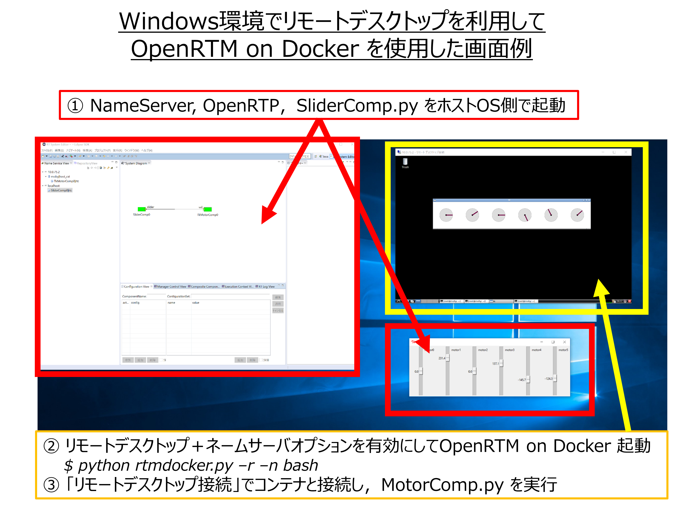
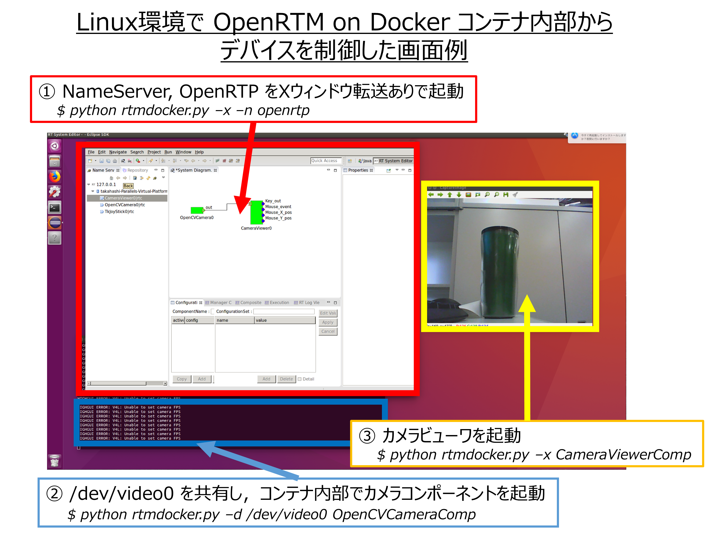

.. test documentation master file, created by
   sphinx-quickstart on Mon Nov 28 17:18:29 2016.
   You can adapt this file completely to your liking, but it should at least
   contain the root `toctree` directive.

OpenRTM on Docker
=================

.. list-table::

  * - Version
    - |release|
  * - Last Update
    - |today|
  * - Author
    - Saburo Takahashi

更新履歴
========

.. csv-table::
  :header-rows: 1
  :widths: 1, 3, 2, 8, 4
  :file: ../data/history.csv


目次
====

.. toctree::
   :maxdepth: 2
   :numbered:
   :glob:

   index

0. OpenRTM on Dockerって何？
============================
OpenRTM on Dockerは `OpenRTM-aist <http://www.openrtm.org/openrtm/>`_ がインストールされたDockerイメージおよび周辺ツール群の総称です．

開発の動機
----------
OpenRTM-aistをもっと簡単に使いたい！
````````````````````````````````````
RTコンポーネント(RTC)を開発する場合、汎用性や後方互換製に配慮する必要があります．
そのためには、OSのバージョンやRTミドルウェアのバージョン、開発PCにインストールされているさまざまなライブラリとの依存関係を疎にする必要があります．
この作業、特に開発環境を整備することが非常に大変で、開発コストの増加に繋がります．
そこで、RTミドルウェアを含むさまざまなライブラリの組み合わせをDockerイメージとして提供することで、開発環境構築コストを低減できると考えました．
また，RTミドルウェア講習会などを通じて，OpenRTM-aistインストールにおけるトラブル事例が多く発生しており，その原因が各自のホスト環境の違いに起因していると感じていました．
OpenRTM on Docker はホストOSの環境差異を吸収でき，実行環境に依らず不変（immutable）な動作ができます．


1. 概要
=======

1.1. 目的
---------

本書はOpenRTM on Dockerの機能や利用方法について記載したドキュメントです．
Docker のインストール方法，OpenRTM on Dockerのイメージ一覧，関連ツールの利用方法を記しています．


1.2. 位置づけ
-------------

本書はOpenRTM on Dockerを利用しているユーザ，および利用を検討している方に向けたドキュメントです．
内容はOpenRTM on Dockerの設計書，ユーザマニュアルを含んでいます．

1.3. 対象ユーザ
------------------

* RTC設計，開発，検証担当者
* RTシステム検証担当者
* RTCおよびRTシステムリリース，運用担当者
* RTM設計，開発，検証担当者
* RTMリリース，運用担当者
* RTM講習会，チュートリアル受講生

1.4. 記載範囲
------------------

* 概要
* 機能
* 制約条件
* 使用方法
* FAQ

1.5. 参照ドキュメント/URL
-------------------------

.. csv-table:: 参照ドキュメント/URL一覧
  :header-rows: 1
  :widths: 1, 4, 6
  :file: ../data/references.csv


1.6. 定義（用語、略語）
-----------------------

.. csv-table:: 用語定義一覧
  :header-rows: 1
  :widths: 1, 2, 6
  :file: ../data/grossary.csv


2. システム構成
==================
OpenRTM on Dockerに含まれるDockerイメージははDocker Engine上で動作するOSとOpenRTM-aistをまとめたコンテナです．
これらのイメージはDocker公式レポジトリであるDocker Hubに各バージョンの最新版が登録されており，複雑な処理無しに利用可能です．
また，OpenRTM on Dockerにはコンテナ起動のためのスクリプト群 OpenRTM on Docker Tools が準備されており，
より簡単に OpenRTM-aist がインストールされた Docker コンテナを試すことができます．

.. image:: ../img/basic.png
  :width: 70%
  :align: center


3. 機能概要
==================

3.1 OpenRTM on Dockerを利用して実現できること
---------------------------------------------
- OpenRTM-aist をホストOSにインストールせずに利用することができる
 - OpenRTPやサンプルコンポーネントをホストPCにインストールせずに起動できる
- 様々なバージョンのOpenRTM-aistを利用したコンパイルや動作確認ができる
 - OS（Ubuntu/Debian/Fedora），OpenRTM-aist（1.1.2/1.2.0（開発途中版）），言語（C++，Python，Java）などの組み合わせが準備済み 
- OpenRTM on Docker を簡単に試すことができるスクリプト群（OpenRTM on Docker Tools）を整備

.. list-table:: OpenRTM on Dockerの応用イメージ

  * - .. image:: ../img/sample1.png
        :width: 100%
    - .. image:: ../img/sample2.png
        :width: 100%

3.2 OpenRTM on Dockerイメージの管理方法
------------------------------------------
OpenRTM-aistやOSのバージョン，プログラミング言語などの組み合わせ数が多いため，
Dockerイメージを作成するためのDockerfileをスクリプトで自動生成し，GitHubに登録しました．
さらにDocker HubとGitHubを連携することで，GitHubの変更を検出し自動的にDockerイメージがビルドされるようになっています．
この仕組みを構築することで，OSのやOpenRTM-aistが更新された場合でも，容易にOpenRTM on Dockerイメージを更新することができます．

.. image:: ../img/ci.png
  :width: 70%
  :align: center

3.3 OpenRTM on Dockerを利用した際の画面例
--------------------------------------------

OpenRTM-aistがインストールされていない Linux 環境でRTCを起動
`````````````````````````````````````````````````````````````
OpenRTM on Docker を用いて，OpenRTM-aist がインストールされていない Linux 環境で NameServer，OprenRTP，サンプルコンポーネント（ConsoleIn，ConsoleOut）を接続した画面例を下記に示します．

.. image:: ../img/screen.png
  :width: 70%
  :align: center

WIndows 環境でサンプルコンポーネントを接続
````````````````````````````````````````````
OpenRTM on Docker を用いて，Windows 環境でサンプルコンポーネントMotorCompをコンテナ内部で起動，SliderCompをホストOS側で起動し，接続した画面例を下記に示します．



Linux 環境でコンテナ内部からデバイスを利用
```````````````````````````````````````````
OpenRTM on Docker を用いて，Linux 環境でコンテナ内部からカメラデバイスを制御した画面例を下記に示します．



4. 機能詳細
==================

.. _rtmdocker:

4.1 OpenRTM on Docker Tools
----------------------------------
OpenRTM on Docker Tools とは，OpenRTM on Docker を実行するためのツール群です．

現在下記のツールが利用可能です．
詳細オプションについては後述します．

.. list-table:: OpenRTM on Docker Toolsに含まれるツール
  :stub-columns: 1

  * - rtmdocker.py
    - Linux/MacOSX/Windows向けOpenRTM on Dockerコンテナ起動スクリプト
  * - rtmdocker_cleaner.py
    - Linux/MacOSX/Windows向けOpenRTM on Dockerイメージ，コンテナ消去スクリプト

rtmdocker.py
`````````````
rtmdocker.py はOpenRTM on Dockerイメージを起動するためのスクリプトです．
起動時にオプションを指定することでコンテナ内のコンポーネントを起動，操作できます．
ネットワークはホストのネットワークデバイスを利用する設定となっているため，
コンテナ内でRTCを起動した場合もホストOS上でRTCを起動した場合と等価に見えます．

ダウンロード方法
''''''''''''''''

.. code-block:: sh

  $ wget -r https://raw.githubusercontent.com/takahasi/docker-openrtm-tools/master/rtmdocker.py

もしくはWebブラウザから https://raw.githubusercontent.com/takahasi/docker-openrtm-tools/master/rtmdocker.py にアクセスすることで最新のものを入手できます．

使用方法
'''''''''
.. code-block:: sh

  $ python rtmdocker.py [オプション] コマンド

お使いのホストOSが Linux の場合，実行にroot権限（sudo）が必要になることがあります．
sudo を不要とする方法については :ref:`Linux で rtmdocker.py を利用する際に sudo が必要になる<sudo>` をご確認下さい．

コマンド
''''''''
.. list-table:: rtmdocker.py コマンド一覧
  :stub-columns: 1

  * - ``openrtp``
    - OpenRTP を起動する
  * - ``bash``
    - bash を起動する
  * - ``Composite``
    - C++ サンプルコンポーネント "Composite" を起動する
  * - ``ConsigSample``
    - C++ サンプルコンポーネント "ConsigSampleComp" を起動する
  * - ``ConsoleIn``
    - C++ サンプルコンポーネント "ConsoleInComp" を起動する
  * - ``ConsoleInPy``
    - Python サンプルコンポーネント "ConsoleInComp" を起動する
  * - ``ConsoleOut``
    - C++ サンプルコンポーネント "ConsoleOutComp" を起動する
  * - ``ConsoleOutPy``
    - Python サンプルコンポーネント "ConsoleOutComp" を起動する
  * - ``ConfigSample``
    - C++ サンプルコンポーネント "ConfigSampleComp" を起動する
  * - ``ConfigSamplePy``
    - Python サンプルコンポーネント "ConfigSampleComp" を起動する
  * - ``Controller``
    - C++ サンプルコンポーネント "ControllerComp" を起動する
  * - ``Motor``
    - C++ サンプルコンポーネント "MotorComp" を起動する
  * - ``SeqIn``
    - C++ サンプルコンポーネント "SeqInComp" を起動する
  * - ``SeqInPy``
    - Python サンプルコンポーネント "SeqInComp" を起動する
  * - ``SeqOut``
    - C++ サンプルコンポーネント "SeqOutComp" を起動する
  * - ``SeqOutPy``
    - Python サンプルコンポーネント "SeqOutComp" を起動する
  * - ``TkJoyStick``
    - Python サンプルコンポーネント "TkJoyStick" を起動する
  * - ``TkLRFViewer``
    - Python サンプルコンポーネント "TkLRFViewer" を起動する
  * - ``MyServiceConsumer``
    - C++ サンプルコンポーネント "MyServiceConsumer" を起動する
  * - ``MyServiceConsumerPy``
    - Python サンプルコンポーネント "MyServiceConsumer" を起動する
  * - ``MyServiceProvider``
    - C++ サンプルコンポーネント "MyServiceProvider" を起動する
  * - ``MyServiceProviderPy``
    - Python サンプルコンポーネント "MyServiceProvider" を起動する
  * - ``Sensor``
    - C++ サンプルコンポーネント "SensorComp" を起動する
  * - ``Affine``
    - OpenCV サンプルコンポーネント "AffineComp" を起動する
  * - ``BackGroundSubtractionSimple``
    - OpenCV サンプルコンポーネント "BackGroundSubtractionSimpleComp" を起動する
  * - ``Binarization``
    - OpenCV サンプルコンポーネント "BinarizationComp" を起動する
  * - ``CameraViewer``
    - OpenCV サンプルコンポーネント "CameraViewerComp" を起動する
  * - ``Chromakey``
    - OpenCV サンプルコンポーネント "ChromakeyComp" を起動する
  * - ``DilationErosion``
    - OpenCV サンプルコンポーネント "DilationErotionComp" を起動する
  * - ``Edge``
    - OpenCV サンプルコンポーネント "EdgeComp" を起動する
  * - ``Findcontour``
    - OpenCV サンプルコンポーネント "FindcontourComp" を起動する
  * - ``Flip``
    - OpenCV サンプルコンポーネント "FlipComp" を起動する
  * - ``Histogram``
    - OpenCV サンプルコンポーネント "HistogramComp" を起動する
  * - ``Hough``
    - OpenCV サンプルコンポーネント "HoughComp" を起動する
  * - ``ImageCalibration``
    - OpenCV サンプルコンポーネント "ImageCalibrationComp" を起動する
  * - ``ImageSubstraction``
    - OpenCV サンプルコンポーネント "ImageSubstractionComp" を起動する
  * - ``ObjectTracking``
    - OpenCV サンプルコンポーネント "ObjectTrackingComp" を起動する
  * - ``OpenCVCamera``
    - OpenCV サンプルコンポーネント "OpenCVCameraComp" を起動する
  * - ``Perspective``
    - OpenCV サンプルコンポーネント "PerspectiveComp" を起動する
  * - ``RockPaperScissors``
    - OpenCV サンプルコンポーネント "RockPaperScissorsComp" を起動する
  * - ``Rotate``
    - OpenCV サンプルコンポーネント "RotateComp" を起動する
  * - ``Scale``
    - OpenCV サンプルコンポーネント "ScaleComp" を起動する
  * - ``Sepia``            
    - OpenCV サンプルコンポーネント "SepiaComp" を起動する
  * - ``SubstractCaptureImage``
    - OpenCV サンプルコンポーネント "SubstractCaptureImageComp" を起動する
  * - ``Template``
    - OpenCV サンプルコンポーネント "TemplateComp" を起動する
  * - ``Translate``
    - OpenCV サンプルコンポーネント "TranslateComp" を起動する


オプション
''''''''''
.. list-table::  rtmdocker.py オプション一覧
  :stub-columns: 1

  * - ``-h, --help``
    - ヘルプメッセージを表示する
  * - ``-v, --version``
    - ツールのバージョンを表示する
  * - ``-n, --nameserver``
    - コマンド実行前にネームサービスを起動する
  * - ``-r, --rdp``
    - コマンド実行前にRDP（Remote Desktop Protocol）サーバーを起動する
  * - ``-t, --tag TAGNAME``
    - 使用するDockerイメージのタグを指定する
  * - ``-u, --upgrade``
    - 使用するDockerイメージを最新版に更新する
  * - ``-d, --device DEVICEFILE``
    - ホストOSのデバイスをコンテナ内からもアクセス可能にする
  * - ``-e, --execute COMPONENT``
    - 指定したコンポーネントをDockerコンテナ内で起動する
  * - ``-c, --compile COMPONENT``
    - 指定したコンポーネントをDockerコンテナ内でコンパイルする（C++のみ）
  * - ``-x, --xforward``
    - X-forwarding を有効にする
  * - ``--dryrun``
    - docker を起動しない（コマンドオプションの確認用）

返り値
''''''''
.. list-table:: rtmdocker.py 返り値一覧
  :stub-columns: 1

  * - ``0``
    - 正常終了
  * - ``1``
    - 異常終了（Docker コマンドが見つからない場合）

rtmdocker_cleaner.py
`````````````
rtmdocker_cleaner.py はキャッシュされたOpenRTM on Dockerイメージやコンテナを消去するためのスクリプトです．
実行時にOpenRTM on Docker以外のDockerコンテナやイメージも削除されますので，
OpenRTM on Docker以外のDockerコンテナやイメージを併用されている場合は使用時に注意して下さい．

ダウンロード方法
''''''''''''''''

.. code-block:: sh

  $ wget -r https://raw.githubusercontent.com/takahasi/docker-openrtm-tools/master/rtmdocker_cleaner.py

もしくはWebブラウザから https://raw.githubusercontent.com/takahasi/docker-openrtm-tools/master/rtmdocker_cleaner.py にアクセスすることで最新のものを入手できます．

使用方法
'''''''''
.. code-block:: sh

  $ python rtmdocker_cleaner.py [オプション]

お使いのホストOSが Linux の場合，実行にroot権限（sudo）が必要になることがあります．
sudo を不要とする方法については :ref:`Linux で rtmdocker.py を利用する際に sudo が必要になる<sudo>` をご確認下さい．


オプション
''''''''''
.. list-table::  rtmdocker_cleaner.py オプション一覧
  :stub-columns: 1

  * - ``-h, --help``
    - ヘルプメッセージを表示する
  * - ``-v, --version``
    - ツールのバージョンを表示する
  * - ``-c, --containers``
    - 全てのDockerコンテナを削除する
  * - ``-i, --images``
    - 全てのDockerイメージを削除する
  * - ``-a, --all``
    - 全てのDockerコンテナ，イメージを削除する
  * - ``--dryrun``
    - docker を起動しない（コマンドオプションの確認用）

返り値
''''''''
.. list-table:: rtmdocker_cleaner.py 返り値一覧
  :stub-columns: 1

  * - ``0``
    - 正常終了
  * - ``1``
    - 異常終了（Docker コマンドが見つからない場合）


.. _images:

4.2 利用できるイメージ（タグ名）
--------------------------------
OpenRTM on Docker で利用できるイメージ一覧です．
起動時にタグ指定することで切換えられます（指定しない場合はlatestが選択されます）．
最新の状況についてはhttps://hub.docker.com/r/takahasi/docker-openrtm/をご確認ください

.. csv-table:: 利用できるイメージ一覧
  :header-rows: 1
  :widths: 6, 4, 3, 2, 2, 2, 2, 2, 3
  :file: ../data/images.csv


5. 制約条件
==================

.. _environment:

5.1 動作環境
-----------------------------
現在 OpenRTM on Docker の動作が確認できているのは下記のホストOSです．
Dockerの仕様上，64bit OSしかサポートしていません．
下記はDockerが正式サポートしているものを列挙していますが，
下記以外においても Docker がインストールできれば OpenRTM on Dockerイメージは動作可能です．

.. list-table:: 動作確認できているホストOS
  :header-rows: 0
  :stub-columns: 1

  * - Windows
    - | Windows Server 2016 64bit（確認中）
      | Windows 10 64bit
  * - Linux
    - | Ubuntu Trusty 14.04 64bit
      | Ubuntu Xenial 16.04 64bit
      | Ubuntu Zesty 17.04 64bit
      | Ubuntu Artful 17.10 64bit（確認中）
      | Fedora 24（確認中）
      | Fedora 25（確認中）
      | CentOS 7（確認中）
      | Debian Wheezy 7.7
      | Debian Jessie 8
      | Debian Stretch 9（確認中）
      | Debian Buster 10（確認中）
      | Raspbian Wheezy 7.7
      | Raspbian Jessie 8
      | Raspbian Stretch 9（確認中）
  * - Mac
    - | OS X El Capitan 10.11
      | macOS Sierra 10.12（確認中）
      | macOS High Sierra 10.13（確認中）


.. _license:

5.2 ライセンス
-----------------------------
OpenRTM on Docker に含まれる Dockerfile やツール群はMITライセンスにより配布されます．
しかし，OpenRTM on Docker イメージに含まれるOSおよび周辺ソフトウェア，OpenRTM-aistのライセンスは別です．
また，ホストOSにインストールされた Docker エンジンについてもライセンスは別扱いとなります．
利用時は最新の情報やインストールしたバージョンを確認し，ライセンス条約に遵守するようにして下さい．

下記に関連する代表的なソフトウェアのライセンス記載箇所を示しますが，
これらは本書執筆時点の情報であるため，
再配布等を行う場合は利用者が再度確認してご利用下さい．

.. list-table:: 代表的なソフトウェアのライセンス

  * - Docker Community Edition
    - | Apache License 2.0
    - https://github.com/moby/moby/blob/master/LICENSE
  * - Docker Components
    - | 右記参照
    - https://www.docker.com/components-licenses
  * - OpenRTM-aist
    - | OpenRTM-aist (C++、Java、Python版)は LGPL と個別契約のデュアルライセンス
      | RTSystemEditor、RTCBuilder は EPL と個別契約のデュアルライセンス
    - http://openrtm.org/openrtm/ja/content/openrtm-aist%E3%81%A8%E3%81%AF%EF%BC%9F-0
  * - OpenRTM on Docker
    - | MIT License
    - https://github.com/takahasi/docker-openrtm/blob/master/LICENSE

.. _network:

5.3 コンテナのネットワーク
-----------------------------
本書ではコンテナに割り振られるIPアドレスをホストOSのネットワークと共通化（Docker の --net==host オプション）する方法で紹介しています．
しかしながら，Docker の制約上，本方式は Linux では正しく動作しますが，Windows，MacOSX では仮想ネットワーク上に別アドレスが割り振られてしまいます
（デフォルトでは 10.0.75.2-254 が割り振られます）．
そのため，MacOSX，Windows で動作させる際はコンテナ内で ifconfig コマンドを使いIPアドレスを確認後に
リモートデスクトップ接続やRT System Editor からのネームサービス接続を行って下さい．

.. _device:

5.4 コンテナからのデバイス制御
-------------------------------
OpenRTM on DOckerではコンテナ内部からデバイスへのアクセスができるオプションが利用できます（Docker の -d オプション相当）．
rtndocker.py を利用する場合は ``-d /dev/ttyUSB0`` ``-d /dev/video0`` などのようにデバイスファイルを指定することで利用できます．
しかしながら，Docker の制約上，本方式は Linux では正しく動作しますが，Windows，MacOSX にはまだ対応していません．
そのため，現状ではMacOSX，Windows で動作させる際はコンテナ外部にプロクシー用のRTCを別途準備する必要があります．
Docker コミュニティでは Windows でもデバイス制御できるように修正を行っているようですので，Docker が対応次第，
OpenRTM on Docker でも動作確認やツールオプションの追加をする予定です．


6. 使用方法
==================

6.1 事前準備（Dockerのインストール）
--------------------------------
インストールする必要があるのは Docker とその依存パッケージのみです．
OpenRTM-aist に関係するパッケージのインストールは一切必要ありません．

Dockerの最新インストール方法はDockerホームページに記載されています．
https://docs.docker.com/engine/installation/

現在，DockerにはCommunity EditionとEnterprise Editionの2種があります．
本書では無料で利用可能な Community Edition を使用する想定で記載していますが，
Enterprise Editionを利用する場合でも一部インストール中の画面構成等が異なるだけで，
本書記載のOpenRTM on Dockerの機能は利用できます．

Windows 
``````````````
Windows ホスト向けDocker(Docker for Windows)は Hyper-V もしくは Virtualbox を利用してLinuxバーチャルマシンを起動し，そのゲストOS上でDockerエンジンを起動します．

1. https://download.docker.com/win/stable/Docker%20for%20Windows%20Installer.exe から Docker のインストーラ(Docker for Windows Installer.exe)をダウンロードします
2. ダウンロードした Docker for Windows Installer.exe を実行し，セットアップウィザードが開始されるので，ライセンスを確認し"I agree"を選択します
3. インストールが開始され，完了後にセットアップウィザードの"Finish"を選択します
4. アプリケーションから Docker for Windows を起動すると Docker が常駐ソフトとして起動されます
5. https://docs.docker.com/docker-for-windows/install/#install-docker-for-windows に詳細が記載されています

Linux(Ubuntu)
``````````````
1. 下記のコマンドを順番にシェル上で実行します

.. code-block:: sh

  $ sudo apt-get remove docker docker-engine docker.io
  $ sudo apt-get update
  $ sudo apt-get install apt-transport-https ca-certificates curl software-properties-common
  $ curl -fsSL https://download.docker.com/linux/ubuntu/gpg | sudo apt-key add -
  $ sudo apt-key fingerprint 0EBFCD88
  $ sudo add-apt-repository "deb [arch=amd64] https://download.docker.com/linux/ubuntu $(lsb_release -cs) stable"
  $ sudo apt-get update
  $ sudo apt-get install docker-ce

2. sudo docker run hello-world を実行し，エラーが発生しなければインストール成功
3. https://docs.docker.com/engine/installation/linux/docker-ce/ubuntu/ に詳細が記載されています

また，下記ツールを利用すれば上記の手順を一括で処理することができます．

.. code-block:: sh

  $ curl -fsSL get.docker.com -o get-docker.sh
  $ chmod +x get-docker.sh
  $ sh get-docker.sh

Linux(Debian)
``````````````
1. 下記のコマンドを順番にシェル上で実行します

.. code-block:: sh

  $ sudo apt-get remove docker docker-engine docker.io
  $ sudo apt-get update
  $ sudo apt-get install apt-transport-https ca-certificates curl software-properties-common
  $ curl -fsSL https://download.docker.com/linux/$(. /etc/os-release; echo "$ID")/gpg | sudo apt-key add -
  $ sudo apt-key fingerprint 0EBFCD88
  $ sudo add-apt-repository "deb [arch=amd64] https://download.docker.com/linux/$(. /etc/os-release; echo "$ID") $(lsb_release -cs) stable"
  $ sudo apt-get update
  $ sudo apt-get install docker-ce

2. sudo docker run hello-world を実行し，エラーが発生しなければインストール成功
3. https://docs.docker.com/engine/installation/linux/docker-ce/debian/ に詳細が記載されています

また，下記ツールを利用すれば上記の手順を一括で処理することができます．

.. code-block:: sh

  $ curl -fsSL get.docker.com -o get-docker.sh
  $ chmod +x get-docker.sh
  $ sh get-docker.sh

Linux(Fedora)
``````````````
1. 下記のコマンドを順番にシェル上で実行します

.. code-block:: sh

  $ sudo dnf remove docker docker-common docker-selinux docker-engine-selinux docker-engine
  $ sudo dnf -y install dnf-plugins-core
  $ sudo dnf config-manager --add-repo https://download.docker.com/linux/fedora/docker-ce.repo
  $ sudo dnf install docker-ce
  $ sudo systemctl start docker

2. sudo docker run hello-world を実行し，エラーが発生しなければインストール成功
3. https://docs.docker.com/engine/installation/linux/docker-ce/fedora/  に詳細が記載されています

また，下記ツールを利用すれば上記の手順を一括で処理することができます．

.. code-block:: sh

  $ curl -fsSL get.docker.com -o get-docker.sh
  $ chmod +x get-docker.sh
  $ sh get-docker.sh

Linux(CentOS)
``````````````
.. code-block:: sh

  $ sudo yum remove docker docker-common docker-selinux docker-engine
  $ sudo yum install -y yum-utils device-mapper-persistent-data lvm2
  $ sudo yum-config-manager --add-repo https://download.docker.com/linux/centos/docker-ce.repo
  $ sudo yum install docker-ce
  $ sudo systemctl start docker

2. sudo docker run hello-world を実行し，エラーが発生しなければインストール成功
3. https://docs.docker.com/engine/installation/linux/docker-ce/centos/  に詳細が記載されています

Linux(Raspbian)
````````````````
下記ツールを利用すれば一括で処理することができます．

.. code-block:: sh

  $ curl -fsSL get.docker.com -o get-docker.sh
  $ chmod +x get-docker.sh
  $ sh get-docker.sh

MacOSX
``````````````
1. https://download.docker.com/mac/stable/Docker.dmg から Docker のディスクイメージ(Docker.dmg)をダウンロードします
2. ダウンロードした Docker.dmg を実行し，Docker アイコンを Applications フォルダにドラッグ＆ドロップします
3. インストールが開始され，成功後は Docker が常駐ソフトとして起動されます
4. https://docs.docker.com/docker-for-mac/install/ に詳細が記載されています


6.2 事前準備（Pythonのインストール）
------------------------------------
後述の OpenRTM on Docker Tools を利用するためにはPythonのインストールが別途必要となります．
Docker コマンドを直接利用する場合はPythonのインストールは必要ありません．
インストールするPythonのバージョンは2.x系，3.x系どちらでも構いません．

Windows 
`````````````` 
1. https://www.python.org/downloads/windows/ から Python のインストーラ(Python-2.x.exeもしくはPython-3.x.exe)をダウンロードします
2. ダウンロードした Pythonインストーラを実行します
3. 環境変数に Python のパスを通すために，インストール中に表示される"Advanced Options" の"Add Python to environment variables"にチェックを入れて下さい
4. インストールが正常に完了した場合，コマンドプロンプトから"python"と入力し，エラーが出ないことを確認して下さい

Linux(Ubuntu)
``````````````
Ubuntuではデフォルトでpythonがインストールされています．もしインストールされていない場合は下記コマンドでインストールできます．

1. 下記のコマンドをシェル上で実行します

.. code-block:: sh

  $ sudo apt-get -y install python

2. python をシェル上で実行し，エラーが発生しなければインストール成功


Linux(Debian)
``````````````
Debianではデフォルトでpythonがインストールされています．もしインストールされていない場合は下記コマンドでインストールできます．

1. 下記のコマンドをシェル上で実行します

.. code-block:: sh

  $ sudo apt-get -y install python

2. python をシェル上で実行し，エラーが発生しなければインストール成功


Linux(Fedora)
``````````````
Fedoraではデフォルトでpythonがインストールされています．もしインストールされていない場合は下記コマンドでインストールできます．

1. 下記のコマンドをシェル上で実行します

.. code-block:: sh

  $ sudo dnf -y install python

2. python をシェル上で実行し，エラーが発生しなければインストール成功


Linux(CentOS)
``````````````
CentOSではデフォルトでpythonがインストールされています．もしインストールされていない場合は下記コマンドでインストールできます．

1. 下記のコマンドをシェル上で実行します

.. code-block:: sh

  $ sudo yum -y install python

2. python をシェル上で実行し，エラーが発生しなければインストール成功

Linux(Raspbian)
````````````````
Raspbianではデフォルトでpythonがインストールされています．もしインストールされていない場合は下記コマンドでインストールできます．

1. 下記のコマンドをシェル上で実行します

.. code-block:: sh

  $ sudo apt-get -y install python

2. python をシェル上で実行し，エラーが発生しなければインストール成功


MacOSX
``````````````
MacOSXではデフォルトでpythonがインストールされています．もしインストールされていない場合は下記手順でインストールできます．

1. https://www.python.org/downloads/mac-osx/ から Python のインストーラ(Python-2.x.pkgもしくはPython-3.x.pkg)をダウンロードします
2. ダウンロードした Pythonインストーラを実行します
3. インストールが正常に完了した場合，ターミナルから"python"と入力し，エラーが出ないことを確認して下さい


6.3 基本的な使用方法
--------------------------
Docker が既にインストールされている環境であれば OpenRTM on Docker が利用できます．  
イメージをダウンロードしてキャッシュするため，初回起動時は外部ネットワークに接続されている必要があり，  
初回起動時のみ起動まで時間がかかります（ネットワーク環境に依存しますが，数分程度）．  
一度キャッシュされてしまえば，２回目移行の起動は速くなります（コンピュータスペックに依存しますが１秒未満）．

OpenRTM on Docker Tools を利用する方法（推奨）
``````````````````````````````````````````````
- 実行にはPythonが必要になります．インストール方法は前節のPythonインストール方法を参照ください
- rtmdocker.py の詳細なオプションについては :ref:`機能詳細 OpenRTM on Docker Tools<rtmdocker>` もしくは ``python rtmdocker.py --help`` で出力される内容を参照下さい
- タグを指定しない場合，最新の全パッケージ入り OpenRTM on Docker イメージを利用します
- HOMEディレクトリが共有されてDockerイメージ内のシェルが起動します  
- シェルを抜けるとコンテナが消去されます
- ネットワークはホストのネットワークデバイスを利用する設定となっているため，コンテナ内でRTCを起動した場合もホストOS上でRTCを起動した場合と等価に見えます

rtmdocker.py は下記コマンド，もしくはWebブラウザから https://raw.githubusercontent.com/takahasi/docker-openrtm-tools/master/rtmdocker.py にアクセスすることで最新のものを入手できます．

.. code-block:: sh

  $ wget -r https://raw.githubusercontent.com/takahasi/docker-openrtm-tools/master/rtmdocker.py

rtmdocker.py は下記のように実行します．

.. code-block:: sh

  $ python rtmdocker.py bash

例えば，サンプルコンポーネントである ConsoleOutComp を動作させる場合，下記のように入力します．

.. code-block:: sh

  $ python rtmdocker.py ConsoleOut


GUIアプリケーションを使う方法
````````````````````````````````````````````````````````

リモートデスクトッププロトコル(RDP)で接続
''''''''''''''''''''''''''''''''''''''''''''''''''''
RDP（Remote Desktop Protocol）サーバがインストールされたイメージを利用している場合，
リモートデスクトップクライアントをホストOSにインストールし，
リモートデスクトップクライアントからローカルホストに対して接続することで，
OpenRTM on Dockerコンテナ内のデスクトップ画面を表示することができます．
接続前にはかならずOpenRTM on Dockerコンテナを -r オプションで起動しておいて下さい．

.. code-block:: sh

  $ python rtmdocker.py -r bash

Windows の場合，リモートデスクトップクライアントは標準インストールされています．
「リモートデスクトップ接続」というアプリケーションを実行し，IPアドレス（標準では 10.0.75.2）を入力後，
下記のユーザ名，パスワードを入力することでデスクトップ画面が表示できます．

Linux の場合，リモートデスクトップクライアント(remmina など)を別途インストールする必要があります．
クライアントアプリケーションを実行し，IPアドレス（標準ではネットワークをホストOSと共有するので127.0.0.1）を入力後，
下記のユーザ名，パスワードを入力することでデスクトップ画面が表示できます．

.. list-table:: リモートデスクトップ接続のパラメータ

  * - プロトコル
    - RDP （Windowsの場合: Xorg， Linux の場合: sesman-Xvnc などを選択）
  * - ユーザ名
    - root
  * - パスワード
    - root


Xウィンドウを利用して接続
''''''''''''''''''''''''''''''''''''
ホストOSにX Window Systemがインストールされていれば，X Window の転送によってコンテナ内のアプリケーションを表示することができます．
Linux であれば標準で X Windows Systemに対応しています．
Windows の場合は Xming http://www.straightrunning.com/XmingNotes/ などを，
McOSX の場合は XQuartz https://www.xquartz.org/ などを別途インストールしておく必要があります．

-x オプションをつけて rtmdocker.py を実行して下さい．

.. code-block:: sh

  $ python rtmdocker.py -x bash

例えば，OpenRTPを利用したい場合，下記のようなコマンドを入力することで起動できます．

.. code-block:: sh

  $ python rtmdocker.py -x openrtp


Docker コマンドを直接利用する方法（中級者向け）
````````````````````````````````````````````````````````
Docker コマンドで直接イメージを起動
''''''''''''''''''''''''''''''''''''''''''''''''''''''''''''''
rtmdocker.py を利用しなくても，直接 Docker コマンドで OpenRTM on Docker のイメージを操作できます．
Docker の操作に慣れている場合，こちらの方法を用いた方が効率良く作業を進められます．

.. code-block:: sh

  $ docker run --rm -ti takahasi/docker-openrtm bash

Docker イメージのバージョンを指定し起動
'''''''''''''''''''''''''''''''''''''''''''''''''''''''''
タグ名を指定することで，任意のバージョンのイメージを利用することができます．

.. code-block:: sh

  $ docker run --rm -ti takahasi/docker-openrtm:ubuntu1404_openrtm112 bash

起動しているコンテナに対してコマンドを実行
'''''''''''''''''''''''''''''''''''''''''''''''''''''''''
既に起動しているコンテナに対して外部からコマンドを実行させることもできます．
まず，上述の方法でコンテナを起動した後に別ターミナルから ``docker ps`` コマンドでコンテナ名を確認します．
以下の例ではコンテナ名は ``docker-openrtm-97`` となります．
rtmdocker.py を使用してコンテナを起動した場合，コンテナ名はdocker-openrtm-[0~99]という名称が割り振られます．
末尾の数字部分はランダムな数字です．

.. code-block:: sh

  $ docker ps
  
  CONTAINER ID        IMAGE                            COMMAND                  CREATED             STATUS              PORTS               NAMES
  d5a173975ba0        takahasi/docker-openrtm:latest   "/bin/bash -c bash"      9 seconds ago       Up 8 seconds                            docker-openrtm-97

コンテナ名を確認後， ``docker exec`` コマンドを使うことでコンテナ内でコマンドが実行できます．
下記の例では ``ls`` コマンドを実行しています．

.. code-block:: sh

  $ docker exec -ti docker-openrtm-97 ls
  bin	 etc	media			      pkg_install_ubuntu.sh  sbin  usr
  boot	 home	mnt			      proc		     srv   var
  dev	 lib	opt			      root		     sys

.. _export:

起動しているコンテナを保存して別の環境で実行する
'''''''''''''''''''''''''''''''''''''''''''''''''''''''''
既に起動しているコンテナに対してファイルシステム一式を保存して，別のPC環境で復元することもできます．
自作のコンポーネント動作環境を配布する際や，不具合の出た環境を再現する際に利用できます．
まず，上述の方法でコンテナを起動した後に別ターミナルから ``docker ps`` コマンドでコンテナ名を確認します．
以下の例ではコンテナ名は ``docker-openrtm-97`` となります．
rtmdocker.py を使用してコンテナを起動した場合，コンテナ名はdocker-openrtm-[0~99]という名称が割り振られます．
末尾の数字部分はランダムな数字です．

.. code-block:: sh

  $ docker ps
  
  CONTAINER ID        IMAGE                            COMMAND                  CREATED             STATUS              PORTS               NAMES
  d5a173975ba0        takahasi/docker-openrtm:latest   "/bin/bash -c bash"      9 seconds ago       Up 8 seconds                            docker-openrtm-97

コンテナ名を確認後， ``docker export`` コマンドを使うことで tar 圧縮形式でコンテナを保存することができます．
下記の例では ``docker-openrtm-97.tar`` という名前で保存しています．

.. code-block:: sh

  $ docker export -o docker-openrtm-97.tar docker-openrtm-97

保存したコンテナを別環境で再度実行する場合は， ``docker import`` コマンドを使います．
import コマンドを行うと保存した環境が新たな Docker イメージとして取り込まれますので，イメージ名やタグ名（タグ名を省略した場合はlatestというタグになります）を設定します．
下記の例では mycomponent というイメージ名で，v1.0というタグ名をつけています．

import が完了したら， ``docker images`` コマンドで意図通りにイメージが作成できているか確認してみます．

.. code-block:: sh

  $ docker import docker-openrtm-97.tar mycomponent:v1.0

  $ docker images

  REPOSITORY                TAG                             IMAGE ID            CREATED             SIZE
  mycomponent               v1.0                            57066ea56c52        4 minutes ago       2.46GB

イメージができていれば，後はそのイメージからコンテナを起動するだけで，環境の復元ができます．

.. code-block:: sh

  $ docker run --rm -ti mycomponent:v1.0 bash


Dockerfileを使ってOpenRTM on Dockerイメージをカスタマイズ
''''''''''''''''''''''''''''''''''''''''''''''''''''''''''''''''''''''''''''

下記を Dockerfile に記載することで，既存のOpenRTM on Docker イメージをベースにカスタマイズすることができます．

.. code-block:: sh

  FROM takahasi/docker-openrtm:ubuntu1404_openrtm112


例えば，自作したコンポーネントを起動時に動作させるためには，
下記のような Dockerfile を作成することでカスタムイメージを作成できます．
依存するライブラリがあるコンポーネントをイメージ化してテストに用いたり，
自作コンポーネントのリリースパッケージとしても利用もできます．

.. code-block:: sh

  FROM takahasi/docker-openrtm:ubuntu1404_openrtm112
  
  COPY MyComponent /usr/bin/
  CMD ["MyComponent", ""]

上記を Dockerfile というファイル名で保存し，下記の様に入力することでカスタムイメージのビルド，実行ができます．

.. code-block:: sh

  $ docker build --network=host -t my_component_image .
  $ docker run --network=host -it my_component_image


7. 応用例・ベストプラクティス
==============================
本節ではOpenRTM on Dockerの応用例やベストプラクティスについて述べます．
新しい事例を随時追加する予定です．

7.1 依存ライブラリのあるコンポーネントのパッケージング
-------------------------------------------------------
ImageToObjectPredictionコンポーネントは深層学習を用いて物体認識を行うコンポーネントです．
深層学習フレームワークであるchainerやコンピュータビジョン向けライブラリであるopencv-pythonを利用しているため，
このコンポーネントを使用するためには依存ライブラリのインストールが不可欠でした．
そこでOpenRTM on Dockerを利用しコンポーネントと依存ライブラリをイメージ化しました．
イメージを起動するとコンポーネントも自動起動されるので，コンテナ＝コンポーネントとして使用できます．

https://github.com/takahasi/docker-openrtm-tools/tree/master/examples/ImageToObjectPrediction

DockerHub にビルド済みのイメージが登録されているので，下記コマンドで試すこともできます．

.. code-block:: sh

  $ docker run --network=host --rm -it takahasi/docker-openrtm-tools:startallexamples


7.2 サンプルコンポーネント群の起動
-------------------------------------------------------
OpenRTM-aist含まれるサンプルコンポーネント群を自動起動するイメージを作成しました．
ちょっとした動作確認に利用できます．

https://github.com/takahasi/docker-openrtm-tools/tree/master/examples/StartAllExamples

DockerHub にビルド済みのイメージが登録されているので，下記コマンドで試すこともできます．

.. code-block:: sh

  $ docker run --network=host --rm -it takahasi/docker-openrtm-tools:imagetoobjectprediction


7.3 Choreonoid用OpenRTM連携プラグイン Python版の起動
-------------------------------------------------------
RTMコンテスト2017の作品である「Choreonoid用OpenRTM連携プラグイン Python版」をDockerイメージ化しました．
動作確認に利用できます．
https://github.com/takahasi/docker-openrtm-tools/tree/master/examples/ChoreonoidOpenRTMPython

作品の詳細は下記をご確認下さい．
http://www.openrtm.org/openrtm/ja/project/contest2017_06

DockerHub にビルド済みのイメージが登録されているので，下記コマンドで試すこともできます．

.. code-block:: sh

  $ docker run --network=host --rm -it takahasi/docker-openrtm-tools:choreonoid_openrtm_plugin


8. FAQ
=====================

8.1 利用可能なPCのスペックは？
------------------------------
ホストOSの種別については本書の :ref:`制約条件 動作環境<environment>` をご確認下さい．
CPUクロックやメモリ要件については調査中です．

8.2 動作性能は？
-----------------
CPU性能については測定中です．
Docker で生成，管理されるコンテナはVirtual Machineと違い，
各命令をトラップするなどのオーバヘッドがかかりません．
理論的にはメモリ空間を仮想化する通常のプロセスと同じ扱いです．

RAM使用量を計測した結果を下記に示します．
OpenRTP はホスト環境で起動した場合も370-420MB ほど使用するので，
あまり差異が無いことがわかります．

.. list-table:: OpenRTM on Docker 使用時のRAM使用量

  * - ホストOS
    - Ubuntu16.04x64
  * - コンテナ
    - Ubuntu16.04x64 (docker-openrtm:ubuntu1604_openrtm112-desktop)
  * - Bash
    - +12MB
  * - OpenRTP
    - +420MB


8.3 利用ライセンスは？
----------------------
本書の :ref:`制約条件 ライセンス<license>` をご確認下さい．

8.4 利用可能なゲストOSは？
--------------------------
主要なLinuxディストリビューションである Ubuntu，Debian，Fedora を利用できるようにしてます．
各バージョンについては本書の :ref:`利用できるイメージ<images>` をご確認下さい．

現在，Docker自体はWindowsゲストOSが利用可能な拡張も存在しているのですが，
まだ動作が不安定であることとCUIのみでのOpenRTM-aistパッケージのインストールが難しいことから対応を見送っています．
対応要望がありましたらRTMコンテスト2017プロジェクトページ http://www.openrtm.org/openrtm/ja/project/contest2017_10 にコメントいただくか，GitHubページ https://github.com/takahasi/docker-openrtm または https://github.com/takahasi/docker-openrtm-tools に issue として登録していただければ随時対応しますので，お知らせ下さい．

8.5 利用するために必要なスキルは？
--------------------------------------------------
CUI での操作が多いため，Linux 系OSの操作に慣れている必要があります．
しかし，最近はKitematicなどのGUIツールでDockerを操作できるようになってきたため，CUI での操作機会は減っています．
また，コンテナによる仮想化の概念を理解していると応用した利用ができます．

8.6 バグを発見した場合には？
-----------------------------
OpenRTM-aist RTMコンテスト2017プロジェクトページ http://www.openrtm.org/openrtm/ja/project/contest2017_10 にコメントいただくか，
GitHubページ https://github.com/takahasi/docker-openrtm または https://github.com/takahasi/docker-openrtm-tools に issue として登録していただければ随時対応します．
また，上記GitHub への pull request もお待ちしております．

.. _sudo:

8.7 Linux で rtmdocker.py を利用する際に sudo を求められる
-----------------------------------------------------------
Docker を実行しているユーザが docker グループに所属していない場合，
ソケットを使用する権限がないため sudo が必要となってしまいます．
sudo を不要にするためには下記のようにユーザを docker グループに所属させ，PCを再起動することで反映できます．
なお，本書では誤操作を防ぐために sudo を抜いた記述に統一しています．

.. code-block:: sh

  sudo groupadd docker
  sudo gpasswd -a $USER docker

8.8 キャッシュされたイメージではなく最新のイメージを利用したい
----------------------------------------------------------------
Docker on OpenRTM は不具合修正や付随するソフトウェアの更新を受けて，DockerHub上で自動ビルドされています．
rtmdocker.py を利用する際に ``-U`` もしくは ``--upgrade`` オプションを付けることによって
最新のイメージをダウンロードすることができます（要ネットワーク接続）．
また， docker コマンドを直接利用している場合は ``docker pull takahasi/openrtm-docker:タグ名`` を実行することで，
保存されたイメージを最新のものに置き換えられます．


8.9 コンテナのネットワーク構成やデバイス利用可否を知りたい
----------------------------------------------------------------
コンテナのネットワーク構成については本書の :ref:`コンテナのネットワーク<network>` をご確認下さい．
またコンテナ内部からのデバイス利用可否については本書の :ref:`コンテナからのデバイス制御<device>` をご確認下さい．


8.10 自分で作成したコンテナを配布したい
----------------------------------------------------------------
Dockerにはコンテナを保存，復元する機能があります．
具体的な方法については本書の :ref:`起動しているコンテナを保存して別の環境で実行する<export>` をご確認下さい．


9. 今後の改善予定
=====================

.. list-table:: 今後の改善予定
  :header-rows: 1

  * - 改善項目
    - 備考
  * - Windows でのコンテナ内部からの外部ネットワークアクセス
    - net=hostオプションが使えないため，ブリッジやポートフォワーディングを工夫する必要がある
  * - Windows RTM コンテナ環境の構築
    - 現状 CUI しか使えないためOpenRTM-aistインストーラがサイレントインストールに対応する必要あり
  * - コンテナ環境を利用したRTCテストツールの開発
    - 構想段階
  * - コンテナ環境を利用したパッケージツールの開発
    - 構想段階
  * - コンテナイメージの整理
    - 数が多過ぎるため，あまり使わない組み合わせを整理すべき
  * - OpenRTM on Docker を Docker Hub 公式レポジトリにする
    - 公式レポジトリにすることでユーザを誘導しやすい
  * - 応用例・ベストプラクティスの拡充
    - ユーザからのコメントを受けられる仕組みの構築
