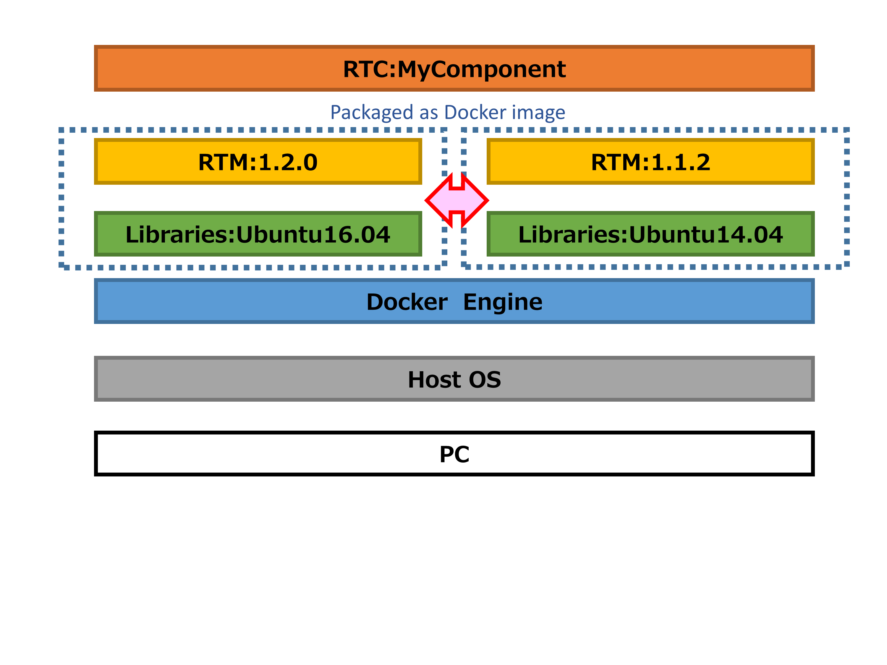
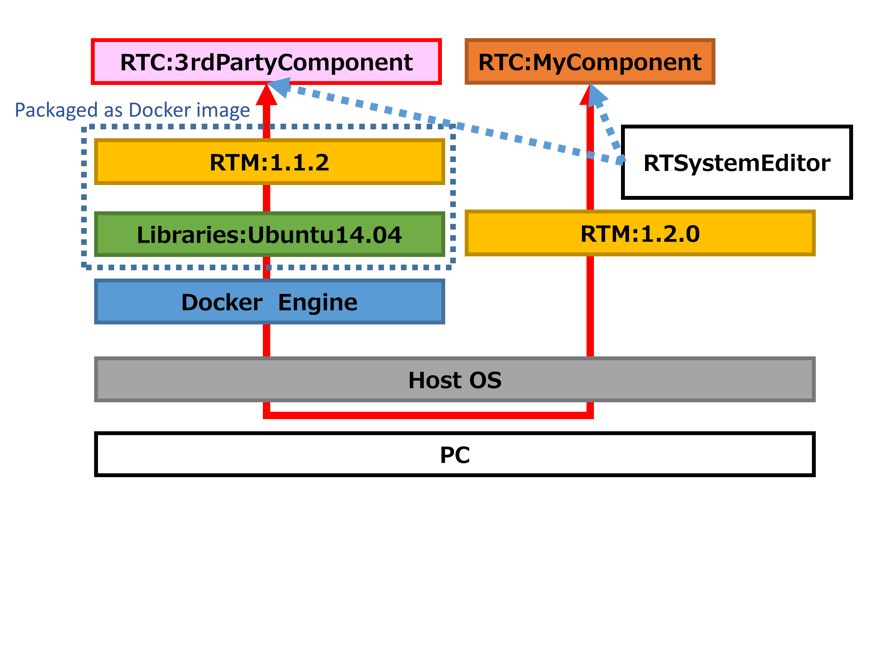

[Japanese](ja/usage)

Usage of OpenRTM on Docker
==========================
Please try;  
`docker run --rm -ti takahasi/docker-openrtm bash`

If you want to select version;  
`docker run --rm -ti takahasi/docker-openrtm:ubuntu1404_openrtm112 bash`

If you customize based on these images,
please add the below in your Dockerfile;  
`FROM takahasi/docker-openrtm:ubuntu1404_openrtm112`

Use GUI application
-------------------

### RDP
Connect container via RDP protocol  
(default user:root, password:root)  
Desktop version only

### X-forwarding
Display window via X-forwarding  
(Linux host only)  

`wget https://raw.githubusercontent.com/takahasi/docker-openrtm/master/scripts/docker-run.sh
chmod +x docker-run.sh
./script/docker-run.sh`

[Top Page](index)
